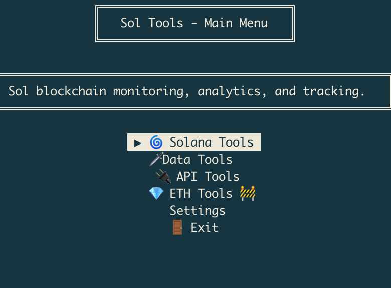
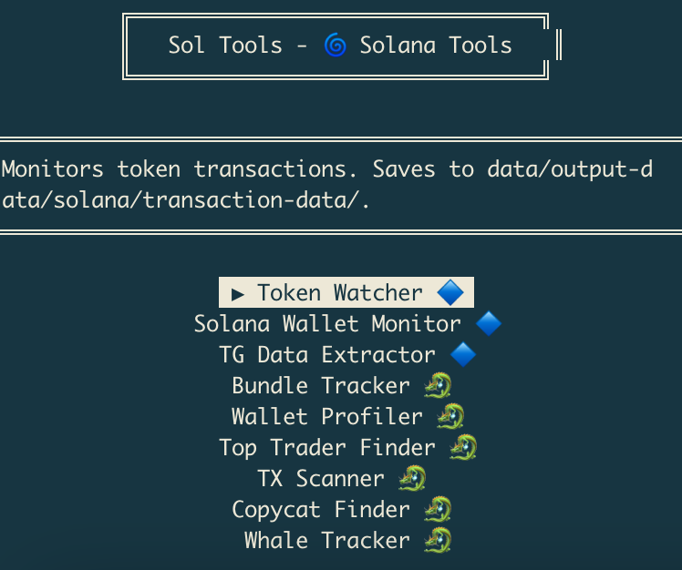
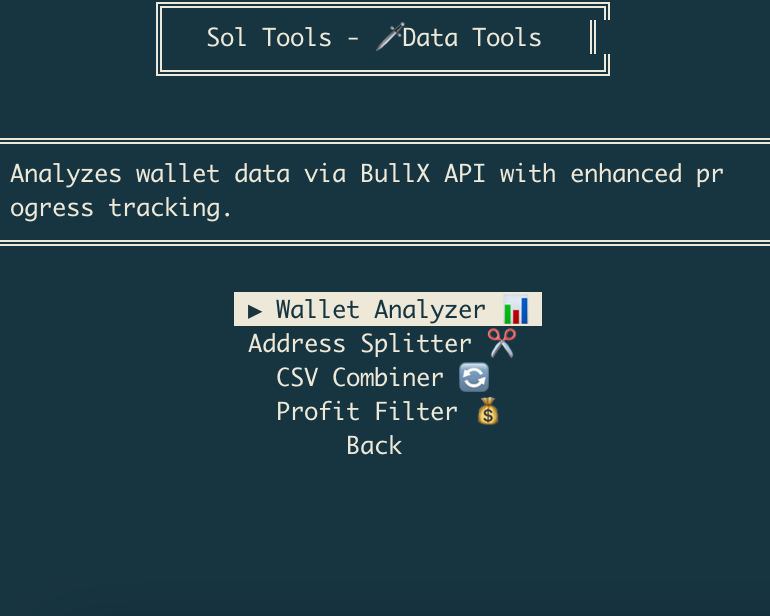
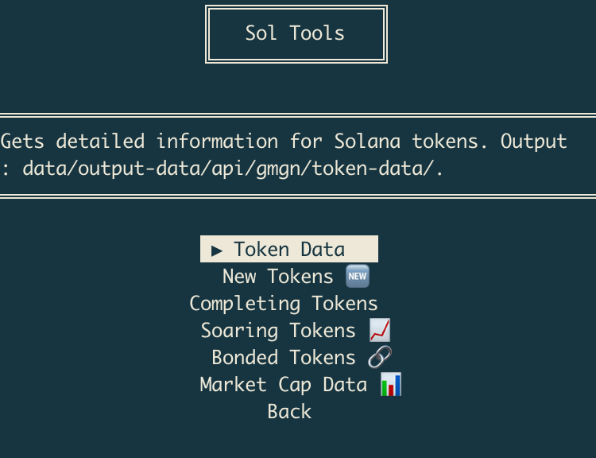
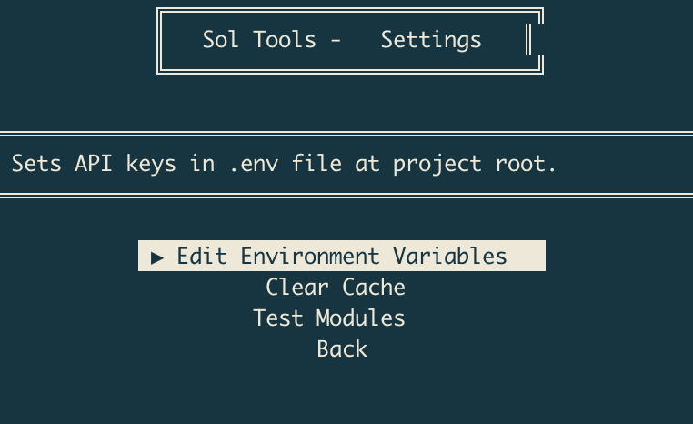

# Sol-Tools

## Install

```bash
pip install -r requirements.txt
pip install -e .
```

## How To Use

```bash
# Launch CLI
sol-tools

# Text menu instead of curses
sol-tools --text-menu

# Show help
sol-tools --help

# Run in test mode
sol-tools --test

# Clean cache
sol-tools --clean
```

## Features
- **Cross-Chain Analysis** for Solana and Ethereum
- **API Integrations** with Dune, GMGN, BullX
- **Interactive CLI** with keyboard navigation

## Screenshots

---

---

---

---

